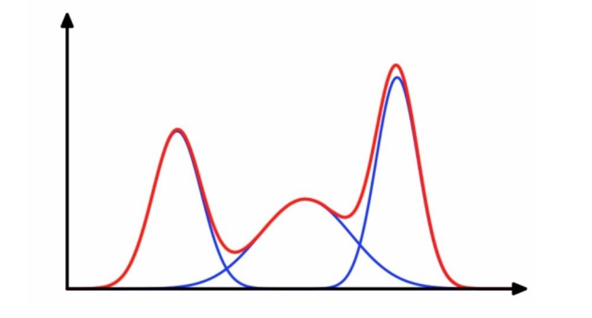
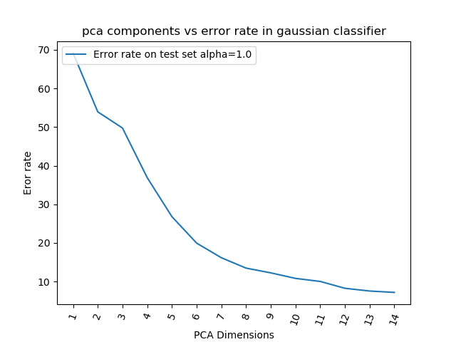
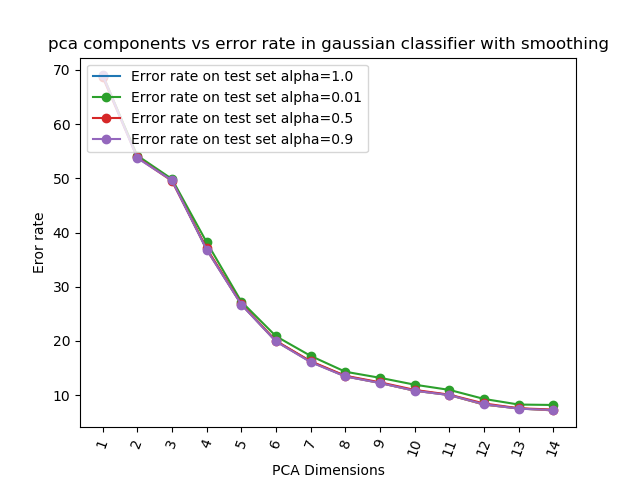
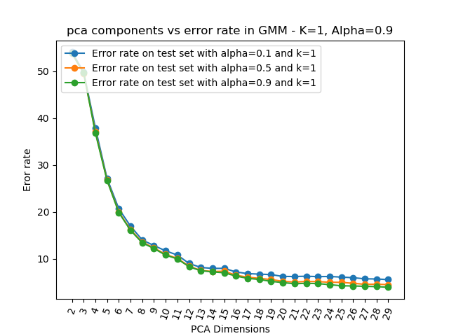
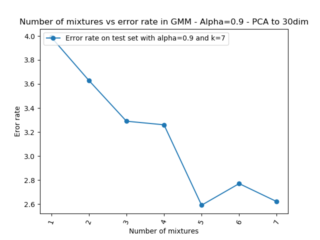

# GMM-classifier

A python implementation of both a Gaussian classifier and Gaussian mixture models.



## Usage

Gaussian classifier
```python
from gaussian_classifier import gaussian_classifier

(x_train, y_train), (x_test, y_test) = get_mnist("data/").load_data()
gauss = gaussian_classifier()
gauss.train(x_train,y_train,alpha=1.0) #Alpha value for smoothing
yhat = gauss.predict(x_test)
yhat!=y_test ## Error rate
```

GMM
```python
from gmm_classifier import gmm_classifier

(x_train, y_train), (x_test, y_test) = get_mnist("data/").load_data()
x_train, y_train, x_validate, y_validate = splitvalidate(x_train,y_train)
gauss = gmm_classifier()
#Here we pass validate data for early stopping
gauss.train(x_train,y_train,x_validate,y_validate,k=5,alpha=1.0) #K number of mixtures and alpha value for smoothing
yhat = gauss.predict(x_test)
yhat!=y_test ## Error rate
```
## Examples
You can check the example on they work with the mnist dataset on gc_mnist.py and gmm_mnist.py scripts under scripts/.

Results from gc_mnist.py

|             Unsmoothed              |              Smoothed               |
| :---------------------------------: | :---------------------------------: |
|  |  |


Results from gmm_mnist.py with mnist data reduced to 30dimensions and 5 mixtures

|          Analysis of alpha           |    Analysis of number of mixtures    |
| :----------------------------------: | :----------------------------------: |
|  |  |
<!-- ```
 It          oL           L trerr teerr

--- ----------- ----------- ----- -----

1        -inf   -260.77247   3.38  3.62
2  -260.77247   -194.82701   3.06  3.46
3  -194.82701   -193.35161   2.65  3.20
4  -193.35161  -191.54592+0.00000j   2.54  3.12
5 -191.54592+0.00000j  -190.32912+0.00000j   2.43  2.93
6 -190.32912+0.00000j  -189.67116-0.00000j   2.37  2.89
7 -189.67116-0.00000j  -189.20456-0.00000j   2.36  2.84
8 -189.20456-0.00000j  -188.92977+0.00000j   2.39  2.80
9 -188.92977+0.00000j  -188.76627+0.00000j   2.36  2.77
10 -188.76627+0.00000j  -188.66041-0.00000j   2.35  2.86
11 -188.66041-0.00000j  -188.58699+0.00000j   2.35  2.87
12 -188.58699+0.00000j  -188.52855-0.00000j   2.34  2.88
13 -188.52855-0.00000j  -188.48319+0.00000j   2.35  2.86
14 -188.48319+0.00000j  -188.44569+0.00000j   2.36  2.85
15 -188.44569+0.00000j  -188.41406+0.00000j   2.40  2.85
16 -188.41406+0.00000j  -188.38972+0.00000j   2.41  2.85
17 -188.38972+0.00000j  -188.36740+0.00000j   2.43  2.87
18 -188.36740+0.00000j  -188.34727-0.00000j   2.44  2.82
19 -188.34727-0.00000j  -188.32775+0.00000j   2.44  2.79
20 -188.32775+0.00000j  -188.30837+0.00000j   2.42  2.80
21 -188.30837+0.00000j  -188.29017+0.00000j   2.45  2.78
``` -->

